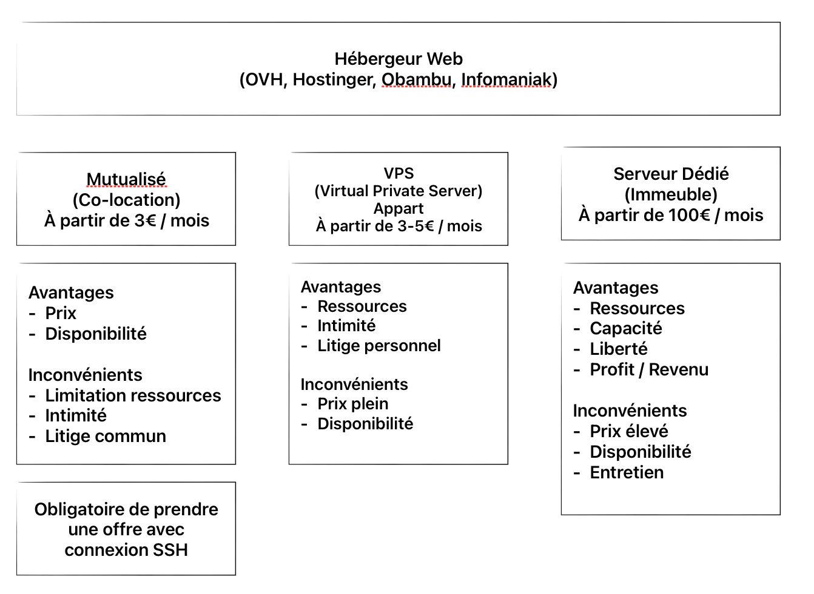
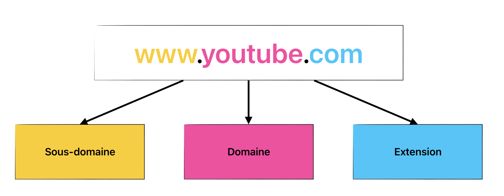

Voici une version corrigée et améliorée de votre texte :  

---

# Récapitulatif 

Semaine du 13 au 18 janvier 2025 – Module Algorithmique  

## Algorithmique  

L'algorithmique est un ensemble d'étapes permettant de résoudre un problème. L'objectif est de produire un résultat qui constitue une solution au problème initial.  

Analyser le problème permet de mieux comprendre ce que l'on cherche à résoudre. Il est important de le décomposer en plusieurs **sous-problèmes**, afin de réduire sa complexité.  

### Avantages de préparer un algorithme avant de coder :  
- Anticiper les problèmes  
- Mettre en œuvre une méthodologie de travail  
- Estimer le temps nécessaire au projet  
- Prévoir les éléments indispensables à sa réalisation  
- Guider le développement lors de l'implémentation*  

Pour conclure, cette étape est indispensable pour toute personne souhaitant développer une application web.  

*Implémentation : traduire un algorithme en code.  

## Scénarios et langage naturel  

Pour construire un algorithme, plusieurs outils sont utiles, comme les scénarios et le langage naturel.  

- **Les scénarios** décrivent simplement les étapes nécessaires pour résoudre un problème.  
- **Le langage naturel** rend les explications accessibles à tous, y compris aux non-techniciens.  

## Algorigramme  

Un **algorigramme** est un schéma visuel qui détaille chaque étape d'un processus algorithmique. Il permet de représenter l'algorithme sous une forme graphique claire.  

## Pseudo-code  

Le pseudo-code est une représentation structurée qui se rapproche de l'organisation du code final. En fonction de vos préférences, vous pouvez utiliser un algorigramme ou du pseudo-code pour concevoir votre algorithme.  

Le pseudo-code permet aussi de clarifier la recherche d'éléments nécessaires à la solution technique. Quelques règles d'écriture :  
- Commencer chaque ligne par un **verbe d'action**  
- Utiliser l'**indentation** pour représenter les structures imbriquées  
- Déclarer les données utilisées dans l'algorithme  

Ce format est également pratique pour ajouter des commentaires lors de l'implémentation dans des langages comme JS, PHP, Python, ou Java.  

## Environnement du web  

### Réseau et protocoles  

Internet repose sur des protocoles de communication (TCP/IP) et des protocoles de transfert de données :  

| Protocole de transfert | Usage | Signification |
| --- | --- | --- |
| HTTP | Transfert de données web | Hypertext Transfer Protocol |
| FTP | Transfert de fichiers | File Transfer Protocol |
| SSH | Accès aux serveurs | Secure Shell |
| SMTP | Envoi d'e-mails | Simple Mail Transfer Protocol |
| POP3 | Accès aux e-mails | Post Office Protocol version 3 |
| IMAP | Accès aux e-mails | Internet Message Access Protocol |  

### Méthodes HTTP  

| Méthode | Usage |
| --- | --- |
| GET | Récupération d'informations |
| POST | Envoi d'informations |
| PUT | Mise à jour complète d'informations |
| PATCH | Mise à jour partielle d'informations |
| DELETE | Suppression d'informations |
| HEAD | Récupération des métadonnées d'une ressource |
| OPTIONS | Obtention des options de communication possibles |

### Codes HTTP  

| Code | Usage |
| --- | --- |
| 200 | Requête réussie |
| 301 | Redirection permanente |
| 302 | Redirection temporaire |
| 403 | Accès interdit |
| 404 | Ressource introuvable |
| 405 | Méthode non autorisée |
| 500 | Erreur interne du serveur |  

## Outils de développement  

### VS Code  

VS Code est un éditeur de code populaire, gratuit et bénéficiant d'un écosystème d'extensions riche.  
Il offre, par défaut :  
- Colorisation syntaxique  
- Auto-complétion  
- Indentation automatique  

Ces fonctionnalités améliorent considérablement l'expérience développeur (DX*).  

*DX : Developer Experience  

### Extensions VS Code  

Les extensions permettent de personnaliser l'éditeur selon ses besoins et de simplifier le travail avec les langages de programmation. Les possibilités sont très nombreuses.  

### Git  

Git, acronyme de "Global Information Tracking", est un système de gestion de version. Il permet de suivre les modifications d'un projet et de les documenter.  
Avantages :  
- Collaboration en équipe  
- Organisation personnelle efficace  
- Indispensable, tout comme l'algorithmique  

### GitHub  

GitHub est une plateforme cloud basée sur Git. Elle permet de :  
- Stocker et partager des projets  
- Gérer des projets (DEVOPS, automatisation, tests)  
- Déployer des applications  

De plus, GitHub propose des outils comme GitHub Copilot, une IA intégrée à VS Code.  

## Hébergement web  

Il existe trois principaux types d'hébergement web :  

  

## Nom de domaine  

  

## Intelligence Artificielle (ex. Perplexity)  

L’intelligence artificielle (IA) joue un rôle de plus en plus important dans le développement logiciel. Par exemple, **Perplexity** est un outil basé sur l’IA qui permet de générer des réponses rapides, basées sur une recherche internet. Ça vous fera gagner du temps contrairement à une recherche classique sur Google.  

### Applications en développement :  
- **Automatisation** : création de tests automatisés, génération de code.  
- **Optimisation** : identification des inefficacités dans un code existant.  
- **Assistant personnel** : aide à la compréhension des concepts complexes ou suggestions en temps réel lors du développement.  

L’IA n’est pas là pour remplacer le développeur, mais pour l’assister et accélérer le processus de création.  

## Librairies de code  

Les librairies sont des collections de fonctionnalités prêtes à l’emploi, facilitant ainsi le développement en évitant de "réinventer la roue".  

### Avantages des librairies :  
- Gain de temps : réutilisation de solutions déjà éprouvées.  
- Communauté : documentation et support souvent disponibles.  
- Qualité : réduction des risques d’erreurs grâce à des solutions testées.  

### Exemples de librairies populaires :  
- **JavaScript** : React, Lodash  
- **PHP** : Guzzle, Faker  
- **Python** : NumPy, Pandas  
- **CSS** : PicoCSS, TailwindCSS, Bootstrap  

En choisissant une librairie, il est important de vérifier sa compatibilité avec le projet, sa popularité, et son niveau de maintenance.  

---

Bon courage dans votre apprentissage et prenez du plaisir à apprendre le développement 🚀
