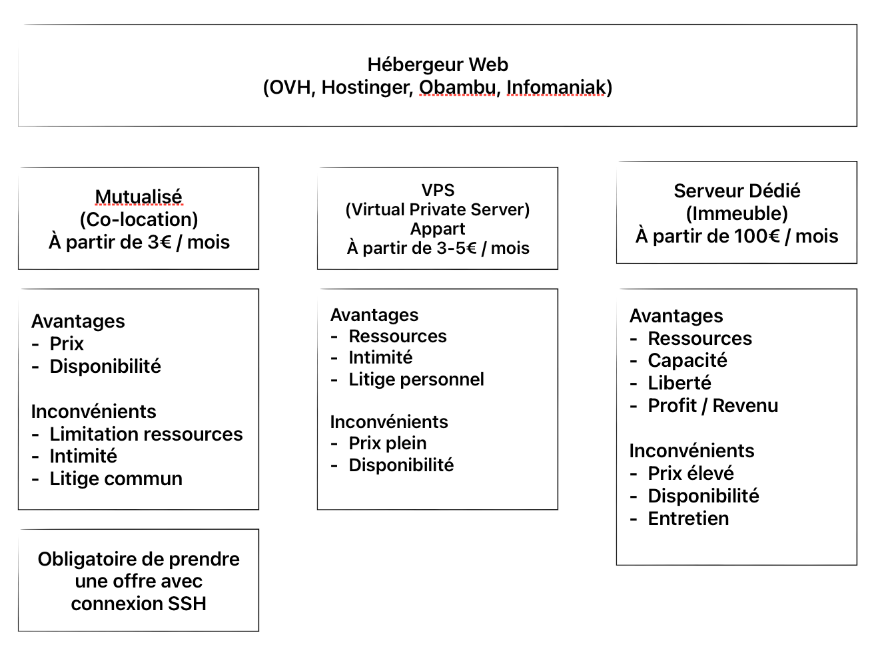
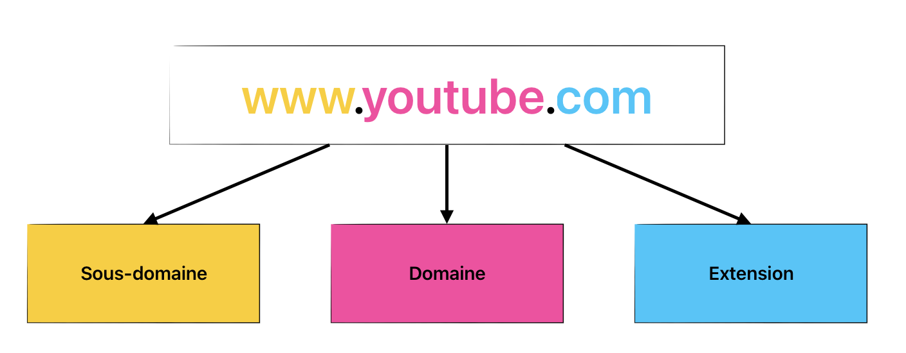

# Récapitulatif 

Récapitulatif de la semaine 13-18 janvier 2025, suite au module Algorithmique.

## Algorithmique

L'algorithmie est un ensemble d'étapes qui permettent de résoudre un problème. L'objectif est d'obtenir un résultat qui sera une solution au problème initial.

Analyser le problème permet de mieux comprendre ce que l'on cherche à résoudre. Il faut le décomposé en plusieurs "sous-problème" afin d'éviter la complexité.

Dans les avantages de préparer un alogirithme avant de commencer à coder à l'aveugle il y a : 

- Anticiper les problèmes
- Mettre en oeuvre une méthodoligie de travail
- Pouvoir estimer le temps nécessaire au travail
- Prévoir les éléments necessaires au projet
- Permet de guider lors de l'implémentation*

Pour conclure, c'est une étape indispensable pour toute personne souhaitant développer une application web.

*Implémentation : traduire un algorithme en code. 

## Scénarios et langage naturel

Pour mettre en place un algorithme, plusieur outils sont utile comme les scénarios et le langage naturel.

Faire des scénarios c'est de décrire de façon simple les étapes à suivre pour résoudre un problème. Le lange naturel, c'est pour rendre le résultat de la lecture compréhensible à tous (non-tech inclus).

## Algorigramme

C'est un schéma (diagramme) qui détaille chaque étape du processus d'un algorithme. L'algorigramme est une représation visuelle de l'algorithme.
 
## Pseudo-code

C'est une représentation proche de l'organisation du code final. 
En fonction de vos facilité ou envie, il est possible d'opter pour un algorigramme ou un pseudo-code afin de mettre en place un algorithme.

Ça peut permettre également d'améliorer les recher d'éléments pour concevoir notre solution technique. Il existe quelques règle d'écriture tels que : 

- L'utilisation de verbes d'action pour commencer chaque ligne
- L'utilisation de l'indentation pour imbriquer les éléments
- déclaration des données utiliser dans l'algorithme

Ce format est utile pour le positionneer en tant que commentaire afin de coder son implémentation dans une feuille de script (JS, PHP, Python, Java, etc.).

## Environnement du web

Tout d'abord i l ya  le réseau, il s'agit d'internet. Il se base sur des protocoles de communication (TCP/IP) et des protocoles de transfert de données :

| Protocole de transfert | Usage | Traduit par |
| --- | --- | --- |
| HTTP | Transfert de données web | Hypertext Transfer Protocol |
| FTP | Transfert de fichiers | File Transfer Protocol |
| SSH | Accès aux serveurs | Secure Shell |
| SMTP | Envoi de mail | Simple Mail Transfer Protocol |
| POP3 | Accès aux mails | Post Office Protocol version 3 |
| IMAP | Accès aux mails | Internet Message Access Protocol |

Concernant le protocol que l'on utilise le plus en dev web (HTTP), voici des détails sur les méthodes et les codes :

### Méthodes HTTP

| Méthode | Usage |
| --- | --- |
| GET | Récupération d'informations |
| POST | Envoi d'informations |
| PUT | Mise à jour d'informations |
| PATCH | Mise à jour d'informations partielles |
| DELETE | Suppression d'informations |
| HEAD | Récupération des informations d'un fichier |
| OPTIONS | Récupération des informations d'un fichier |

### Code HTTP

| Code | Usage |
| --- | --- |
| 200 | Requête réussie |
| 301 | Redirection d'une URL permanente |
| 302 | Redirection d'une URL temporaire |
| 403 | Requête non autorisée |
| 404 | Requête non trouvée |
| 405 | Droits insuffisants |
| 500 | Erreur interne du serveur |

## Outils de développement

Pour développer des application web, il nous faut diférrents outils de travail, tel qu'un éditeur de code ou encore de serveur local.

### VS Code 

C'est un éditeur parmi beaucoup, qui présente un avantage imbattable qui est sa gratuité et en second on peut aussi noter son écosystème d'extension.

Avec VS Code, on dispose par défault de la colorisation syntaxique (couleur du code), l'autocomplétion, l'indentaion. Ce sont dés éléments qui améliore la DX*.

*Developper eXperience

### Extensions VS Code

Les extension permettent de personnaliser l'éditeur en fonctionction de ses préférences. Mais également de faciliter le travail avec les langages de programmation. Les possiblités sont très nombreuses.

### GIT 

GIT qui signifie, Global Information Tracking, est un système de gestion de version de code. Il permet de suivre les changements d'un projet et de les documenter. Cela vous ouvre les portes à la collaboration en équipe et aussi à une organisation personnel plus efficace. Il est aussi important que l'alogrithmie.

### GitHub

Plateforme cloud, qui permet de stocker et de partager des projets. Il se base sur GIT et met à disposition des outils de gestion de projet, de DEVOPS et de déploiement, d'autmomatisation et de tests.

C'est gratuit et vous avez accès à GitHub Copilot qui est une IA intégrée dans VS Code.

## Hébergement Web

Il existe 3 trois principaux type de'hébergement web :

## Nom de domaine

## IA (expl. Perplexity)
## Librairies de code